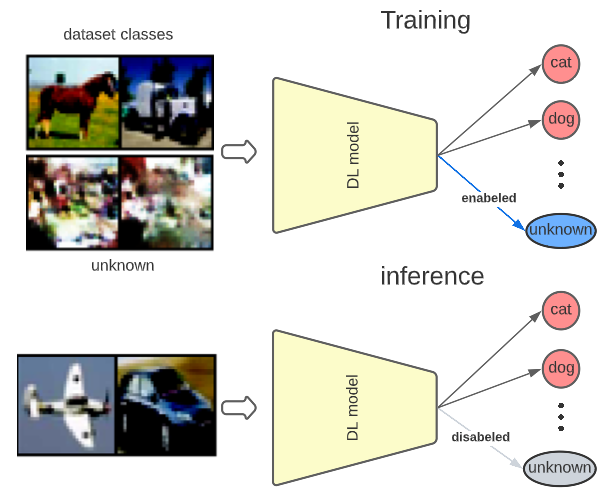

# FedOS: using open-set learning to stabilize training in federated learning

## abstract
Federated Learning is a recent approach to train statistical models on distributed datasets without violating privacy constraints. The data locality principle is preserved by sharing the model instead of the data between clients and the server. This brings many advantages but also poses new challenges. In this report, we explore this new research area and perform several experiments to deepen our understanding of what these challenges are and how different problem settings affect the performance of the final model. Finally, we present a novel approach to one of these challenges and compare it to other methods found in literature.

## method 
FedOS utilise an additional unkown class during training to stabilise it, those the method is divided in 3 phases.
- Pre-training : the objective of this phase is to model the unkown class
- Training : the unknown output is added and the loss is also updated to take into account misclassified umkown samples.
- Post-training : the unkown output is disabeled and the global model is ready

For more details refer to the report found on https://arxiv.org/abs/2208.11512 

